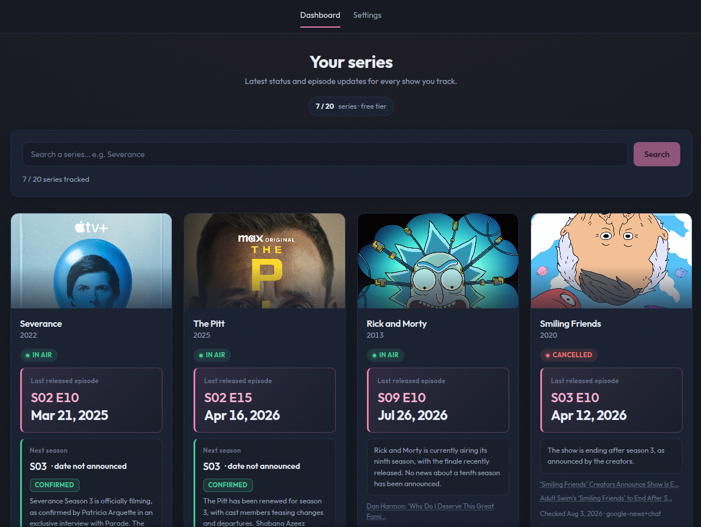

<h1 align="center">Series Tracker</h1>

<p align="center">
🍿 TV-show tracker built with Next.js 16 and Drizzle ORM on libsql/Turso. Add shows from TVMaze, get daily automated news checks for new-season announcements and premiere dates analyzed by any OpenAI-compatible LLM. Bring-your-own-key with AES-256-GCM encryption, free-tier cap, and hourly Vercel Cron batches.
</p>

<br>

<p align="center"></p>

<br>

## ✨ Features

### 📺 Tracking

- **Series dashboard** — every tracked show renders as a card with TVMaze poster, premiere year, live status badge (`In air`, `Returning`, `Upcoming`, `Ended`, `Cancelled`), last released episode (e.g. `S02 E04`), and a one-tap **Refresh** action.
- **Next-season intel** — the news engine extracts the next season or episode with its premiere date, marked `confirmed`, `approx` or `unconfirmed`, plus up to three source links as evidence.
- **TVMaze-powered search** — the add-series flow queries the TVMaze API through a server-side proxy, deduplicates by `tvmaze_id` per user, and stores normalized show metadata (posters, genres, status, summary) in `series_info`.
- **Check history** — every successful run is persisted to `series_news` and surfaced as an expandable "Recent checks" ledger inside each card.
- **Priority sorting** — cards are ordered by attention first: failed checks, then queued/checking, then cards with news changes, then missing-key states, then the rest.
- **Free-tier cap** — accounts without a verified LLM key are limited to 20 series (`FREE_TIER_MAX_SERIES`); verified BYOK accounts get unlimited tracking.

### 🧠 News engine

- **Two-source discovery** — the check runs Google News RSS first and falls back to GDELT when Google returns nothing; an empty result from both produces an honest "no news found" state instead of a hallucinated one.
- **LLM analysis with a strict schema** — the top 4 articles are sent to any OpenAI-compatible chat completions endpoint with a rigid JSON spec; the response is repaired (trailing commas, adjacent objects) and validated with a Zod schema (`newsResultSchema`) before anything is persisted.
- **Deterministic status merge** — `normalizeShowStatus` trusts news evidence for `returning`/`upcoming`/`in_air` and only lets TVMaze override into terminal states (`ended`, `cancelled`) — so a stale source can never kill a running show.
- **Change detection** — each check records `has_changes`; cards with fresh news changes are visually marked and sorted higher.
- **Provider-agnostic** — every user can bring their own key, base URL, and model; the server can also run a shared fallback key (`FALLBACK_LLM_API_KEY`) for free-tier users.
- **JSON-line observability** — every batch and individual check emits a single-line JSON event (`lib/observability.ts`) for log-driven debugging.

### 🔐 Security

- **Email/password auth** — credentials via NextAuth v5 with JWT sessions, bcrypt-hashed passwords, and a `session_version` counter that force-expires all sessions when a password changes.
- **AES-256-GCM BYOK vault** — user LLM keys are encrypted at rest (`ENCRYPTION_KEY`, 64 hex chars in production) and only decrypted in memory at check time.
- **SSRF guard for provider URLs** — user-supplied OpenAI-compatible base URLs are resolved and rejected if they point at localhost, private ranges, or cloud metadata endpoints (`lib/security/provider-url.ts`) before a credential is ever sent.
- **Rate limiting** — a sliding-window limiter backed by the `rate_limits` table guards login (10 attempts / 15 min per email) and refresh (10 / 10 min per user).
- **Same-origin enforcement** — mutating API routes reject cross-site requests via origin/host comparison.
- **Hardened headers** — `X-Content-Type-Options: nosniff`, `X-Frame-Options: DENY`, strict `Referrer-Policy`, restrictive `Permissions-Policy`, and `poweredByHeader` disabled.
- **Zod everywhere** — every API payload and every LLM output shape is validated at the boundary.

### ⚡ Automation

- **Vercel Cron** — `vercel.json` schedules `/api/cron/daily-news` hourly; it claims up to 8 due shows per run (24h interval, 1h retry backoff for failed checks, 10-minute claim timeout so crashed runs don't wedge rows).
- **Queue-less claims** — `checkStatus` + `checkClaimedAt` on the `series` row double as a distributed lock; a manual refresh only runs when nothing is claimed.
- **Manual refresh API** — `POST /api/series/[id]/refresh` re-runs the full pipeline on demand from the card UI.

### 🎨 Design & UX

- **Dark-first "marquee" theme** — ink-navy surfaces with a single champagne-pink accent (cinema marquee light), tinted shadows, and a subtle film-grain overlay.
- **Outfit typography** — self-hosted variable font with tabular figures for episode codes, dates, and counters.
- **Ownable brand mark** — an S-trail that doubles as a timeline: start node (pink), episode ticks along the path, a highlighted "you are here" marker, and an ivory destination node; reused as the favicon and in empty/error states.
- **Status semantics** — green for in-air/returning, periwinkle for upcoming, red for cancelled, gray for ended/unknown; confirmation tags (`confirmed` / `approx` / `unconfirmed`) on premiere dates.
- **Responsive by design** — mobile collapses the topbar into a two-row grid, stacks search and action rows, and switches the card grid to a single column.
- **Accessible** — semantic landmarks (`header`, `main`, `nav`, `article`, `details`), visible gold focus rings, `aria-current` on the active nav item, `aria-live` search status, and `role="alert"` on errors.
- **Behavior-preserving states** — composed empty state with the brand mark, skeleton-free loading row, inline form errors, and a branded error boundary with a retry action.

### 🔍 SEO & metadata

- **Typed metadata** — title and description in the root layout, branded `app/icon.svg` favicon, no duplicate boilerplate.
- **Per-show poster pipeline** — TVMaze images are served through Next.js `next/image` with an allowlisted remote pattern (`static.tvmaze.com`), explicit sizes, and lazy loading below the fold.

<br>

## 🛠️ Tech stack

| Area            | Technology                                                             |
| --------------- | ---------------------------------------------------------------------- |
| Framework       | [Next.js](https://nextjs.org) `16` (App Router)                        |
| UI              | React `19` with server components + targeted client components         |
| Language        | TypeScript `5`                                                         |
| Auth            | [NextAuth](https://next-auth.js.org) `5` (credentials + JWT)           |
| Database        | [Drizzle ORM](https://orm.drizzle.team) + [libsql](https://turso.tech) |
| Validation      | [Zod](https://zod.dev) `4`                                             |
| News sources    | Google News RSS + GDELT API                                            |
| LLM runtime     | Any OpenAI-compatible chat completions endpoint                        |
| Styling         | Vanilla CSS with custom-property design tokens                         |
| Tests           | `node:test` + `tsx`                                                    |
| Linting         | ESLint `9` (flat config)                                               |
| Cron            | [Vercel Cron](https://vercel.com/docs/cron-jobs) (hourly)              |
| Package manager | npm                                                                    |

<br>

## 🏗️ Architecture

```
series-tracker/             # This repo
├── app/
│   ├── (app)/              # Authenticated shell
│   │   ├── page.tsx        # Dashboard (series grid, add panel, empty state)
│   │   ├── settings/       # News engine + account security panels
│   │   ├── layout.tsx      # Auth guard + topbar shell
│   │   ├── loading.tsx     # Route loading state
│   │   └── error.tsx       # Branded error boundary
│   ├── (auth)/             # login / register pages
│   ├── api/
│   │   ├── account/password/   # Change password (bumps session_version)
│   │   ├── auth/[...nextauth]/ # NextAuth handler
│   │   ├── cron/daily-news/    # Hourly batch check (CRON_SECRET bearer)
│   │   ├── register/           # Account creation
│   │   ├── series/             # search, POST (add), DELETE, refresh
│   │   └── settings/byok/      # Save / test / clear BYOK key
│   ├── icon.svg            # Brand-mark favicon
│   └── layout.tsx          # Root layout, Outfit font, metadata
├── components/             # brand, brand-mark, topbar, topbar-nav, add-series,
│                            # series-card, byok-form, password-form, sign-out-button
├── db/
│   ├── schema.ts           # users, series_info, series, series_news, rate_limits
│   └── index.ts            # libsql client + Drizzle instance (env-guarded)
├── drizzle/                # Generated custom SQL migrations
├── lib/
│   ├── news/               # engine, google, gdelt, chat, schema, persist, tvmaze
│   ├── security/           # provider-url (SSRF guard)
│   ├── api-helpers.ts      # requireUser + same-origin guard
│   ├── crypto.ts           # AES-256-GCM encrypt / decrypt / mask
│   ├── keys.ts             # BYOK resolution, free-tier limit
│   ├── observability.ts    # Single-line JSON events
│   ├── rate-limit.ts       # DB-backed sliding-window limiter
│   └── tvmaze.ts           # TVMaze client helpers
├── scripts/
│   ├── migrate.ts          # Apply migrations
│   └── refresh-user.ts     # Manually trigger checks for one user
├── styles/                 # Token-driven CSS (tokens, layout, series, news, ...)
├── tests/                  # node:test unit tests
├── types/                  # Shared types
├── auth.ts                 # NextAuth config (credentials + JWT callbacks)
├── next.config.ts          # Security headers, image remote patterns
├── drizzle.config.ts
├── vercel.json             # Hourly cron schedule
└── package.json
```

### 🔍 Notable implementation details

- **Distributed claim instead of a queue** — the cron and the manual refresh both go through `checkAndPersist`, which claims the row (`checkStatus = "checking"` + `checkClaimedAt`) atomically. A stale claim older than 10 minutes can be re-claimed, so a crashed worker never blocks a show permanently.
- **LLM output is treated as untrusted input** — the chat response passes through `parseJsonResponse` (repairs adjacent JSON objects, trailing commas, stray prose) and then a strict Zod schema with length caps on every field. Any malformed output degrades to a `failed` check, never a stored lie.
- **Evidence-first sources** — the engine prefers the LLM's cited sources when it returns them and falls back to the original article payload, keeping at most 3 links visible per card.
- **BYOK keys never touch the client again** — after the test endpoint verifies a key, the dashboard only sees `sk-••••••••` placeholders; decryption happens in a single server module (`lib/keys.ts`) at check time.
- **Passwords rotate sessions globally** — `session_version` is read inside the JWT callback on every request; changing the password bumps it, invalidating every previous token.
- **One source of truth for statuses** — `normalizeShowStatus(news, tvmaze)` in `lib/news/schema.ts` encodes the merge rules and is covered by unit tests, so the badge logic can't drift from the data model.
- **Local-first database** — `DATABASE_URL=file:./data.db` runs the whole app against a plain SQLite file; production requires a durable libsql/Turso URL, enforced by an env guard at import time.

<br>

## 🚀 Getting started

### 📋 Prerequisites

- Node.js `^20` (Next.js 16)
- npm

### 📦 Installation

```sh
# 📥 Clone the repository
git clone https://github.com/nady4/series-tracker

# 📂 Move to the project folder
cd series-tracker

# 📄 Configure the environment
cp .env.example .env

# 📦 Install dependencies
npm install
```

### 💻 Run the dev server

```sh
npm run db:migrate   # apply schema migrations to data.db
npm run dev
```

Open <http://localhost:3000>, create an account, and search for a series to track.

> No LLM key is needed for local testing: leave `FALLBACK_LLM_API_KEY` empty and the news check reports a `no_key` state on each card. Set a key (or a BYOK key in Settings) to run the real pipeline.

### 🧹 Lint, type-check and tests

```sh
npm run lint          # ESLint
npx tsc --noEmit      # TypeScript type-check
npm test              # node:test unit tests
```

### 🏗️ Build for production

```sh
npm run build
npm start
```

<br>

## 📜 Scripts

| Command                    | Description                                               |
| -------------------------- | --------------------------------------------------------- |
| `npm run dev`              | Start the dev server with hot reload                      |
| `npm run build`            | Build for production (type-check + client/server bundles) |
| `npm start`                | Serve the production build                                |
| `npm run lint`             | Run ESLint                                                |
| `npm test`                 | Run unit tests with `node:test`                           |
| `npm run db:push`          | Push the schema directly (dev only)                       |
| `npm run db:migrate`       | Apply generated migrations                                |
| `npm run db:new-migration` | Generate a new custom SQL migration                       |

<br>

## 🌐 Environment

| Variable                | Required   | Purpose                                                           |
| ----------------------- | ---------- | ----------------------------------------------------------------- |
| `DATABASE_URL`          | Yes (prod) | libsql URL (Turso) or `file:./data.db` locally                    |
| `DATABASE_AUTH_TOKEN`   | Prod       | Turso auth token for remote libsql databases                      |
| `AUTH_SECRET`           | Yes        | NextAuth secret (`openssl rand -base64 32`)                       |
| `AUTH_TRUST_HOST`       | Dev        | Set to `true` for local HTTP dev                                  |
| `CRON_SECRET`           | Yes        | Bearer token guarding `/api/cron/daily-news`                      |
| `ENCRYPTION_KEY`        | Yes        | 64 hex chars (`openssl rand -hex 32`), AES-256-GCM key material   |
| `FALLBACK_LLM_API_KEY`  | Optional   | Server-side LLM key for users without BYOK                        |
| `FALLBACK_LLM_BASE_URL` | Optional   | Base URL for compatible providers (OpenRouter, Groq, Ollama, ...) |
| `FALLBACK_LLM_MODEL`    | Optional   | Model name (defaults to `gpt-4o-mini`)                            |

<br>

## 🚢 Deployment

The app is built for [Vercel](https://vercel.com):

1. Connect the repository and set the environment variables above (a Turso database is required — local files don't survive on serverless).
2. Deploy; the first build verifies the database connection and image allowlist.
3. `vercel.json` already registers the hourly cron — verify it appears under **Project → Settings → Cron Jobs**.
4. Apply schema changes with `npm run db:new-migration` locally, review the SQL in `drizzle/`, then run `npm run db:migrate` (or a hosted migration runner) before or after deploy — installing dependencies never mutates the database.

### 🤝 Extending the news engine

The check pipeline is pluggable by design: add a new article source next to `lib/news/google.ts` and `lib/news/gdelt.ts` (same `{ title, url }[]` contract), or point the fallback key at any OpenAI-compatible provider via `FALLBACK_LLM_BASE_URL` / `FALLBACK_LLM_MODEL` without touching the analysis code.

<br>

## 📜 License

Released under the [MIT License](https://opensource.org/licenses/MIT). The TVMaze metadata and poster images are the property of their respective owners.

<br>

## 📬 Contact

### 👩🏻‍💻 GitHub: [@nady4](https://github.com/nady4)
